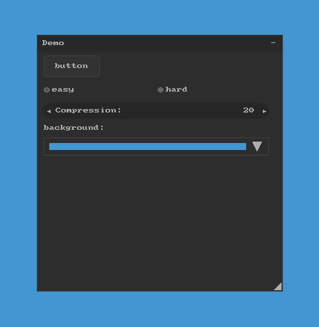

# Nuklear for SDL 1.2

[SDL](https://www.libsdl.org/) 1.2 support for [Nuklear](https://github.com/vurtun/nuklear).



## Dependencies

- [SDL 1.2](https://github.com/libsdl-org/SDL-1.2)
- [SDL_gfxPrimitives](https://github.com/ferzkopp/SDL_gfx)

## API

``` c
struct nk_context*   nk_sdl_init(SDL_Surface *screen_surface);
void                 nk_sdl_handle_event(SDL_Event *evt);
void                 nk_sdl_render(struct nk_color clear);
void                 nk_sdl_shutdown(void);
```

## Credit

- [Micha Mettke](https://github.com/vurtun)
- [Rob Loach](https://github.com/robloach)

## License

- [Public Domain](LICENSE)
